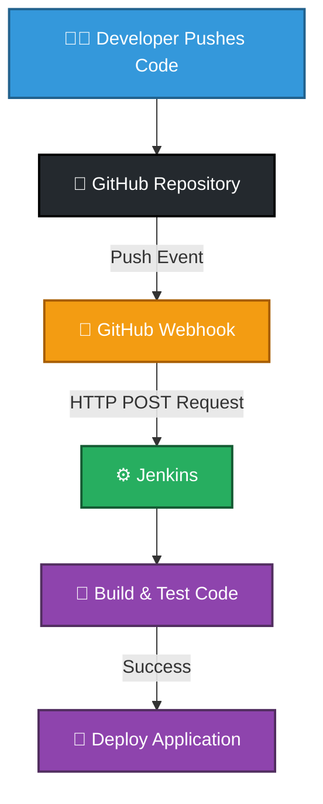
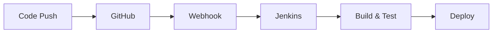

# How GitHub Webhooks Are Used

GitHub webhooks are commonly used to **automate actions whenever something happens in a repository**.

## Example 1: CI/CD Pipeline (Most Common)

When a developer pushes code:

## Flow

1. Developer pushes code to GitHub.
2. GitHub detects the **push** event.
3. GitHub sends a webhook request to Jenkins.
4. Jenkins automatically:
   - Pulls the latest code.
   - Builds the application.
   - Runs tests.
   - Deploys the application if everything succeeds.

## Benefits

- Automatic build and deployment.
- Faster feedback for developers.
- Reduced manual effort.
- Consistent CI/CD workflow.

## Summary

GitHub Webhooks enable event-driven automation:

